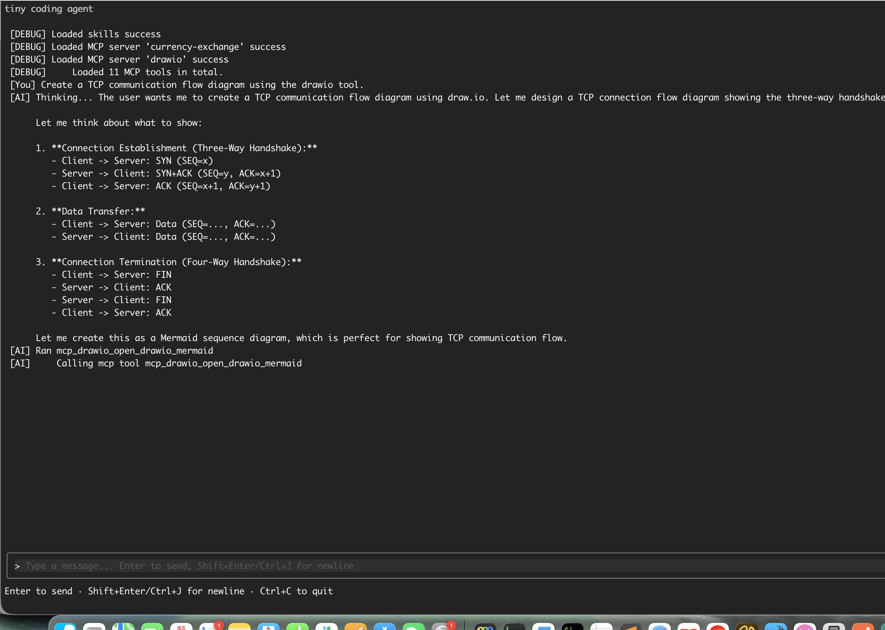

# Tiny Coding Agent

A tiny coding agent written in Go 

用Go语言实现的tiny coding agent

---

## Features

 
- [x] coding / 编码
- [x] skills
- [x] MCP
- [x] context compact / 上下文压缩
- [x] hooks / 钩子

---

## Quick Start

### Prerequisites

- Go 1.22+
- An Anthropic-compatible API key / 兼容 Anthropic 的 API和密钥即可

### 1. Setup

```bash
# Clone the repository 
git clone <repo-url>
cd tiny-coding-agent

# Install dependencies
go mod tidy
```

### 2. Configuration

```bash
mkdir -p ~/.tiny-coding-agent
cp conf.example ~/.tiny-coding-agent/agent.conf
```

vim `~/.tiny-coding-agent/agent.conf`:

```
ANTHROPIC_BASE_URL=
ANTHROPIC_API_KEY=
MODEL=
```

| Variable | Description  | Example   |
|----------------|--------------------|----------------|
| `ANTHROPIC_BASE_URL` | Anthropic API base URL / Anthropic API兼容协议地址 | `https://api.deepseek.com/anthropic` |
| `ANTHROPIC_API_KEY` | Your Anthropic API key / API密钥 | `sk-ant-...` |
| `MODEL` | The model to use / 模型 | `deepseek-v4-flash` |


### 3. Run

```bash
# debug
go run ./cmd/tiny-coding-agent/main.go
```

install
```bash

# install
go install ./cmd/tiny-coding-agent

# project dir
tiny-coding-agent
```

---


### MCP Servers / MCP 服务器

Configure external MCP servers to extend the agent's capabilities.

配置外部 MCP服务以扩展代理能力。

`.tiny-coding-agent/.mcp.json` 配置至 project 根目录下的示例文件:

```json
{
    "mcpServers": {
        "currency-exchange": {
            "type": "http",
            "url": "https://currency-mcp.wesbos.com/mcp"
        },
        "drawio": {
            "type": "stdio",
            "command": "npx",
            "args": [
                "@drawio/mcp"
            ]
        }
    }
}
```

### Skills / 技能

Place `SKILL.md` files in the following directories:

将 `SKILL.md` 文件放置在以下目录：

| Directory / 目录 | Description / 描述 |
|------------------|--------------------|
| `.tiny-coding-agent/skills/` | Project agent skills / 项目级 |
| `~/.tiny-coding-agent/skills/` | Global skills (user-level) / 全局级  |

---
  
### Hooks
    
`.tiny-coding-agent/hooks.json`:

```
{
    "hooks": {
        "PreToolUse": [
            {
                "matcher": "Write|Edit",
                "hooks": [
                    {
                        "type": "command",
                        "command": "echo \"PreToolUse hook triggered\""
                    }
                ]
            }
        ],
        "PostToolUse": [
            {
                "matcher": "Write|Edit",
                "hooks": [
                    {
                        "type": "command",
                        "command": "echo \"PostToolUse hook triggered\""
                    }
                ]
            }
        ]
    }
}
```

### preview




---

## License / 许可证

[MIT](LICENSE)
